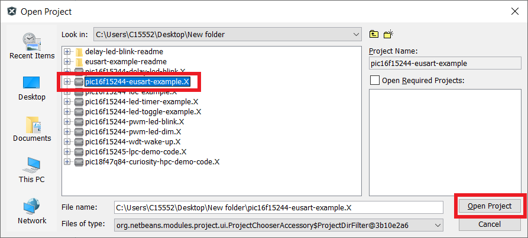
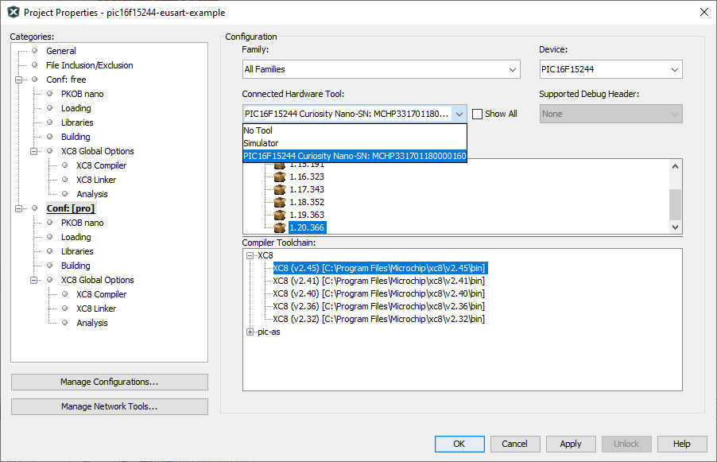
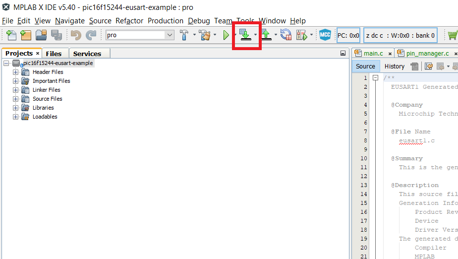
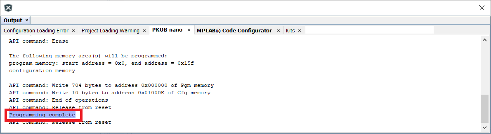
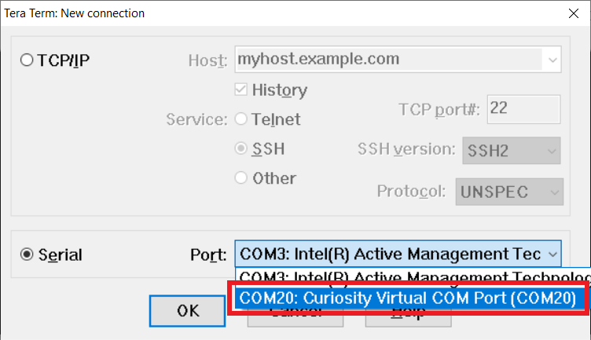
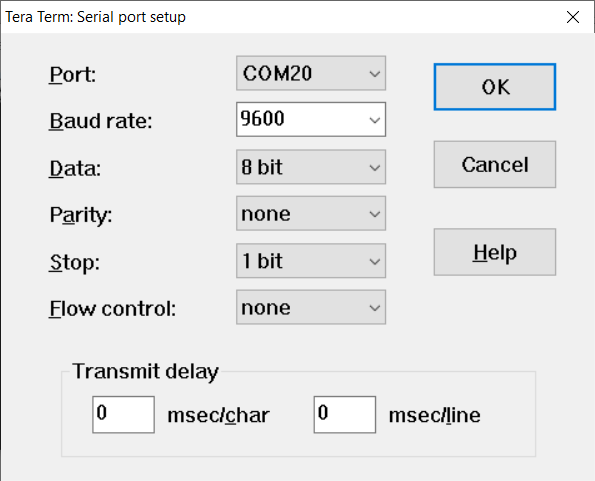
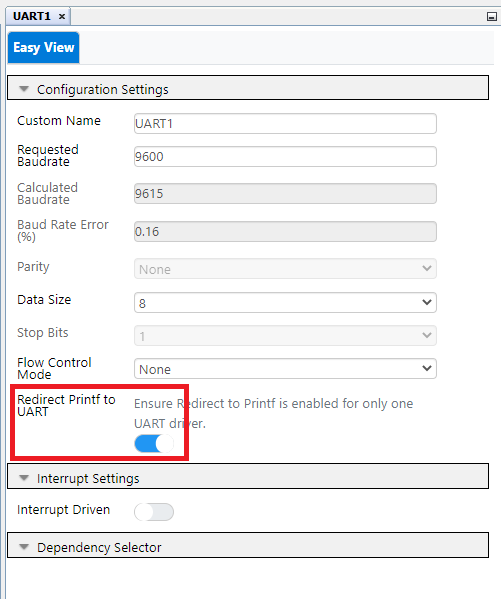
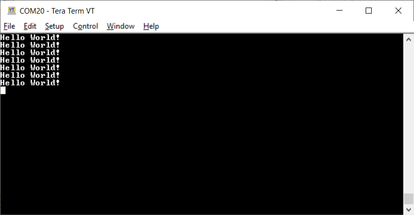

<!-- Please do not change this html logo with link -->

# Transmit "Hello World!" to a Terminal Program using EUSART with PIC16F15244

The 'pic16f15244-eusart-example' code example uses the PIC16F15244 Curiosity Nano Development board to demonstrate how to transmit "Hello World!" to a PC terminal application using the EUSART module.

##### PIC16F15244 Curiosity Nano Development Board:

## Related Documentation
- [PIC16F15244 Product Page](https://www.microchip.com/wwwproducts/en/PIC16F15244)

## Software Used
- MPLAB® X IDE 5.45 or newer [(microchip.com/mplab/mplab-x-ide)](http://www.microchip.com/mplab/mplab-x-ide)
- MPLAB® XC8 2.31 or a newer compiler [(microchip.com/mplab/compilers)](http://www.microchip.com/mplab/compilers)
- MPLAB® Code Configurator (MCC) 4.1.0 or newer [(microchip.com/mplab/mplab-code-configurator)](https://www.microchip.com/mplab/mplab-code-configurator)
- Microchip PIC16F1xxxx Series Device Support (1.5.133) or newer [(packs.download.microchip.com/)](https://packs.download.microchip.com/)

## Hardware Used
- PIC16F15244 Curiosity Nano [(EV09Z19A)](https://www.microchip.com/Developmenttools/ProductDetails/EV09Z19A)
- Micro-USB to USB 2.0 cable

## Setup
1. Connect the PIC16f15244 Curiosity Nano board to a PC using the Micro-USB to USB 2.0 cable.
2. If not already on your system, download and install MPLABX IDE version 5.40 (or newer).
3. If not already on your system, download and install the XC8 C-Compiler version 2.20 (or newer).
4. Open the 'pic16f15244-eusart-example.X' project as shown in Figure 1.

  ###### Figure 1: Open Project Window
  

5. Press the 'Project Properites' button to open the Project Properties window. Select the Curiosity tool from the Tools drop-down menu as shown in Figure 2.

  ###### Figure 2: Select the Nano in Project Properties Window
  

6. Press the 'Make and Program Device' button to program the PIC (see Figure 3). Verify that the device was successfully programmed (see Figure 4).

  ###### Figure 3: 'Make and Program Device' Button
  

  ###### Figure 4: Program Complete
  

7. Open a terminal program on your PC. For this example, Tera Term was used as the terminal program.

  a. Select the port that is used by the Nano board as shown in Figure 5.  
  b. Configure the serial port as shown in Figure 6.  
  ###### Figure 5: Select the USB Port
  

  ###### Figure 6: Configure the Serial Port
  

## Operation
After the Nano board is programmed, the EUSART module will transmit the string "Hello World!" to the PC terminal window at a baud rate of 9600 bps. Output pin RC0 is configured as the TX output through PPS. Nano hardware also connects pin RC0 to the USB receive line, allowing a quick connection to the PC terminal without any additional wires or USB bridge circuits.

The EUSART module is configured to use the `printf()` function call that it built in to the XC8 libraries. In MCC, simply mark the 'Redirect STDIO to USART' check-box as shown in Figure 7, and the additional function calls are added to the project. Example 1 shows the use of the `printf()` function.

  ###### Figure 7: 'Redirect STDIO to USART' Check-box
  

###### Example 1: `Main()` Code Snippet

      void main(void)
      {
          SYSTEM_Initialize();                   // Initialize the device

          while (1)
          {
              printf("Hello World! \r\n");       // Write over EUSART
              __delay_ms(2000);                  // Two second delay
          }
      }

## Summary
The 'pic16f15244-delay-led-blink' code example uses the PIC16F15244 Curiosity Nano Development board to demonstrate how to transmit "Hello World!" to a PC terminal application using the EUSART module. Once programmed, the EUSART will transmit the string 'Hello World!' to a PC terminal program.

###### Figure 8: Hello WOrld!

